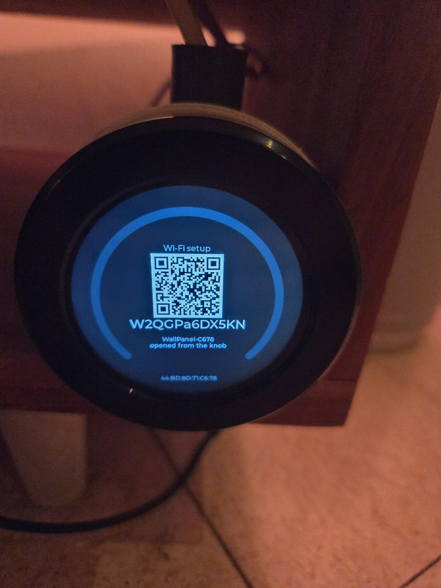
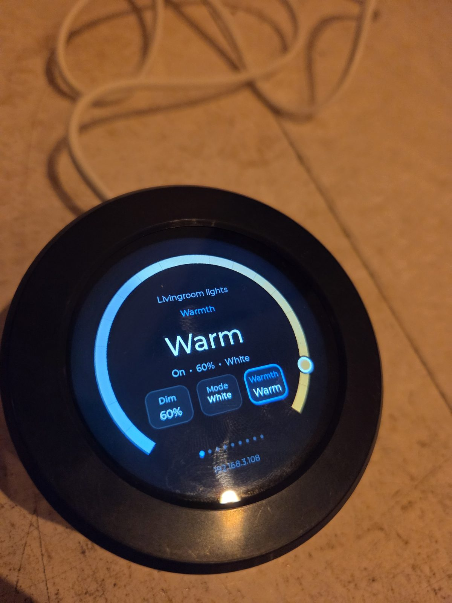

# Homey wall panel

A €48 round touchscreen on the wall that drives a room in Homey: lights, the thermostat,
moods, music, energy, an alarm clock, who is home. Swipe between cards, turn the ring to
set a value, press the knob to switch.


It is a companion to the **Wear OS Controller** app for Homey, which is where a panel is
configured — you pick the cards for a room in the app, and they appear on the wall.

> **Status:** running on a wall, and still moving. One board is supported today; the
> firmware is built per board, so a panel is only ever offered an image built for its own
> hardware.

## Experimenting early

A panel works and hangs on a wall here, but this is young. The Homey side moves most weeks and
panel changes land in the test version first, so trying one now means living with that. Two
things make it a soft landing: a panel updates itself from Homey, so the cable moment really is
once, and nothing on it is configured by hand — a panel that shows the wrong thing is one
**Repair** away from right.

Worth telling us about, in [issues](https://github.com/kaohlive/homey-wallpanel/issues): a card
that reads wrong for a device you own, a device whose controls do not fit a ring sensibly, a
panel that keeps dropping off Wi-Fi, or anything about the printed parts. Say which board, which
firmware version (it is on the panel's device page in Homey) and which app version. A photo of
the screen usually says more than a paragraph.

## What you need

1. A supported board — see [Boards](#boards) below. Nothing is soldered, nothing is
   modified; it arrives ready and runs from a USB supply, with the cable that comes with it.
2. A Homey Pro with the **Wear OS Controller** app, and for now that means the
   [test version](https://homey.app/a/com.kaoh.wearoscontroller/test/) — the same app, newest
   build. Take it before you flash: panel firmware from 1.24.0 on refuses an answer that is not
   signed by your Homey, and only app 1.35.0 and newer signs one. A panel flashed today and
   pointed at an older app will simply show nothing.
3. One cable moment, once per panel. After that a panel updates itself from Homey.

## Getting one going

### 1. Flash the firmware, once

A board out of the box has no Wi-Fi, no firmware, and no idea Homey exists, so Homey has no
way to reach it. That first image goes on over USB — and never again, because from then on
updates come from Homey over Wi-Fi.

**The easy way:** open the [web flasher](https://kaohlive.github.io/homey-wallpanel/flash/),
plug the panel into your computer with the cable that came with it, and click Install. It works in Chrome
and Edge on Windows, macOS and Linux; nothing to install.

**The other way:** download the `-factory.bin` for your board from
[Releases](https://github.com/kaohlive/homey-wallpanel/releases) and write it with
[esptool](https://docs.espressif.com/projects/esptool/en/latest/):

```bash
esptool.py --chip esp32s3 --port COM3 --baud 921600 write_flash 0x0 homey-panel-crowpanel21-<version>-factory.bin
```

Each release carries two files per board. The **factory** image is the whole flash and is
what a fresh board needs. The **ota** image is the app partition only; Homey uses it to
update a panel that is already running, and you do not need to download it.

### 2. Tell the panel where it is

A panel with nothing saved opens its own Wi-Fi network:

1. The screen shows **Wi-Fi setup**, a network name (`WallPanel-XXXX`) and an eight-digit
   password. That password is different every time and only shown on the panel, so setting
   one up means standing in front of it.

   
2. Join that network with a phone. The setup page opens by itself; otherwise go to
   `192.168.4.1`.
3. Pick your network, type its password, and paste the pairing code from
   **Homey → Wear OS Controller → app settings → Copy pairing code**.
4. Save. The panel restarts and joins.

Both are kept on the panel itself and survive restarts and updates. The setup network also
opens if the panel has been without Wi-Fi for five minutes, or when you hold the knob for
five seconds — so changing your Wi-Fi password never means fetching a cable.

### 3. Add it in Homey and give it cards

In Homey, add a device from the Wear OS Controller app and pick your panel from the list.
Then open **Repair** on that device to choose what it shows: a room, and the cards for it.
Changes land on the wall within a few seconds.



Firmware updates appear on the same device page, as a button. The panel downloads the image,
checks it against a hash that came from Homey over a signed connection, and restarts.

## Boards

| Board | id | What it is | Status |
| --- | --- | --- | --- |
| [Elecrow CrowPanel 2.1" rotary](https://www.elecrow.com/crowpanel-esp32-display-2-1-inch-hmi-display-round-screen-touch-lcd.html) | `crowpanel21` | ESP32-S3, 480×480 round IPS touchscreen with a rotary knob around it, power and USB on one 4-pin connector | Supported |

Only a board listed here has an image in a release, and Homey will never offer a panel
firmware built for different hardware. If you would like another display supported, open an
issue and say which one — the protocol and the Homey side are the same for every board; what
differs is the screen driver, the touch controller and the pin map.

## Enclosures

3D models to print live in [`models/`](models/), in PETG. A cup holds the panel and twists into a
base: a flush mount that drops into a wall box and makes its own 5 V behind the panel, or a stand
that holds it on a desk and runs from a USB adapter. Twisting the cup off moves the same panel
between them.


## Privacy and what runs where

A panel talks only to your Homey, on your own network. There is no cloud, no account and no
telemetry. Every request it makes is signed with a key that was set up when you paired it,
and it never receives your Wi-Fi password from Homey — you typed that into the panel itself.

Firmware images published here contain no credentials of any kind, and the build refuses to
bundle an image whose build injected anything from its environment.

## Where the source is

This repository carries what you need to run a panel: the firmware images, the models and
these instructions. The source lives elsewhere and is not public.

Issues and questions about the panel are welcome here.

## Licence

The documentation and the 3D models are licensed
[CC BY-SA 4.0](https://creativecommons.org/licenses/by-sa/4.0/): use them, change them, print
them, sell the prints — keep the attribution, and share changes to the models under the same
terms. The web flasher page in [`flash/`](flash/) is MIT. The firmware images are
distributed as binaries for use on the boards listed above; they are not licensed for
redistribution as part of another product.
